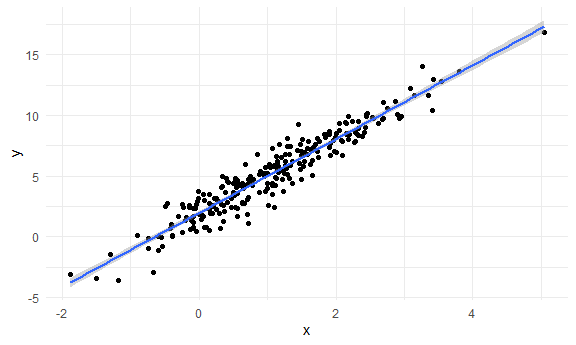
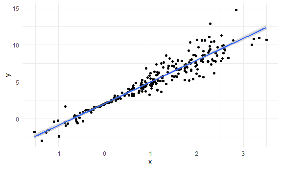
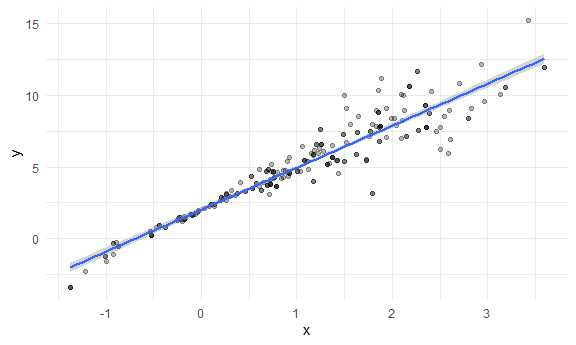

Bootstrapping
================

``` r
library(tidyverse)
```

    ## -- Attaching packages ------------------------------------------------------------------------------------------------------------------ tidyverse 1.3.0 --

    ## v ggplot2 3.3.2     v purrr   0.3.4
    ## v tibble  3.0.3     v dplyr   1.0.2
    ## v tidyr   1.1.2     v stringr 1.4.0
    ## v readr   1.3.1     v forcats 0.5.0

    ## -- Conflicts --------------------------------------------------------------------------------------------------------------------- tidyverse_conflicts() --
    ## x dplyr::filter() masks stats::filter()
    ## x dplyr::lag()    masks stats::lag()

``` r
library(modelr)

knitr::opts_chunk$set(
  fig.width = 6,
  fig.asp = 0.6,
  out.width = "90%"
)

theme_set(theme_minimal() + theme(legend.position = "bottom"))

## all plots i make will have the viridis color palette
options(
  ggplot2.continuous.colour = "viridis",
  ggplot2.continuous.fill = "viridis"
)

scale_colour_discrete = scale_colour_viridis_d
scale_fill_discrete = scale_fill_viridis_d
```

## Simulate Data

``` r
n_samp = 250

sim_df_const = 
  tibble(
    x = rnorm(n_samp, 1, 1),
    error = rnorm(n_samp, 0, 1),
    y = 2 + 3 * x + error
  )

#new error structure
sim_df_nonconst = sim_df_const %>% 
  mutate(
  error = error * .75 * x,
  y = 2 + 3 * x + error
)
```

Plot the datasets

Shows linear line residuals have constant variance (good for most
assumptions of simple linear regression)

``` r
sim_df_const %>% 
  ggplot(aes(x = x, y = y)) +
  geom_point() +
  geom_smooth(method = "lm")
```

    ## `geom_smooth()` using formula 'y ~ x'



Doesn’t meet assumptions well Residuals spread out later on
(heteroscedasticty) Can solve this with a bootstrap

``` r
sim_df_nonconst %>% 
  ggplot(aes(x = x, y = y)) +
  geom_point() +
  geom_smooth(method = "lm")
```

    ## `geom_smooth()` using formula 'y ~ x'



Fit linear regs for both dataset

``` r
lm(y ~ x, data = sim_df_const) %>% broom::tidy()
```

    ## # A tibble: 2 x 5
    ##   term        estimate std.error statistic   p.value
    ##   <chr>          <dbl>     <dbl>     <dbl>     <dbl>
    ## 1 (Intercept)     1.99    0.0890      22.4 2.08e- 61
    ## 2 x               3.00    0.0622      48.2 5.15e-128

``` r
lm(y ~ x, data = sim_df_nonconst) %>% broom::tidy()
```

    ## # A tibble: 2 x 5
    ##   term        estimate std.error statistic   p.value
    ##   <chr>          <dbl>     <dbl>     <dbl>     <dbl>
    ## 1 (Intercept)     2.05    0.0865      23.7 1.08e- 65
    ## 2 x               2.95    0.0605      48.7 6.54e-129

## Draw 1 Bootstrap sample

Assumptions aren’t met in the nonconst data set (understand what the
distribution of intercepts are slope are in repeated sampling) - find
actual slope and intercept through repeated sample We don’t trust the CI
and the uncertainity estimates that go along with it

`sample_frac` draws a sample of a particular proportion from your
dataset (by default with grab a sample that is proportional (1:1)
proportion with the size of the dataset) We want it to be the same size
because CI are very dependent on the sample size

`arrange` because we know the df we’re passing through will have an x
and y and we want them arranged that way

``` r
boot_samp = function(df) {
  
  sample_frac(df, size = 1, replace = TRUE) %>% 
    arrange(x)
  
}
```

Check if the function works

Some observations are coming in twice Darker points signify that those
values appear multiple times in the dataset due to replacement

``` r
boot_samp(sim_df_nonconst) %>% 
  ggplot(aes(x = x, y = y)) +
  geom_point(alpha = 0.3) +
  geom_smooth(method = "lm")
```

    ## `geom_smooth()` using formula 'y ~ x'



Fit a regression with the bootstrap samples

``` r
boot_samp(sim_df_nonconst) %>% 
  lm(y ~ x, data = .) %>% 
  broom::tidy()
```

    ## # A tibble: 2 x 5
    ##   term        estimate std.error statistic   p.value
    ##   <chr>          <dbl>     <dbl>     <dbl>     <dbl>
    ## 1 (Intercept)     2.16    0.0858      25.1 4.27e- 70
    ## 2 x               2.95    0.0596      49.5 1.25e-130
