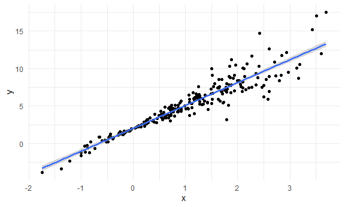
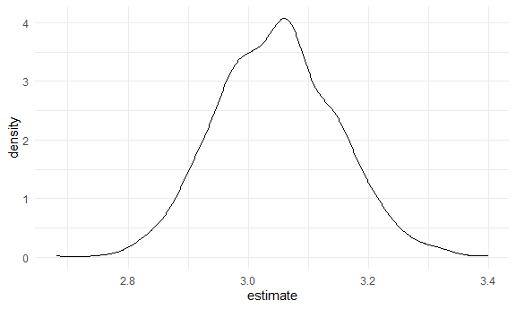

Bootstrapping
================

``` r
library(tidyverse)
```

    ## -- Attaching packages ------------------------------------------------------------------------------------------------------------------ tidyverse 1.3.0 --

    ## v ggplot2 3.3.2     v purrr   0.3.4
    ## v tibble  3.0.3     v dplyr   1.0.2
    ## v tidyr   1.1.2     v stringr 1.4.0
    ## v readr   1.3.1     v forcats 0.5.0

    ## -- Conflicts --------------------------------------------------------------------------------------------------------------------- tidyverse_conflicts() --
    ## x dplyr::filter() masks stats::filter()
    ## x dplyr::lag()    masks stats::lag()

``` r
library(modelr)

knitr::opts_chunk$set(
  fig.width = 6,
  fig.asp = 0.6,
  out.width = "90%"
)

theme_set(theme_minimal() + theme(legend.position = "bottom"))

## all plots i make will have the viridis color palette
options(
  ggplot2.continuous.colour = "viridis",
  ggplot2.continuous.fill = "viridis"
)

scale_colour_discrete = scale_colour_viridis_d
scale_fill_discrete = scale_fill_viridis_d
```

## Simulate Data

``` r
n_samp = 250

sim_df_const = 
  tibble(
    x = rnorm(n_samp, 1, 1),
    error = rnorm(n_samp, 0, 1),
    y = 2 + 3 * x + error
  )

#new error structure
sim_df_nonconst = sim_df_const %>% 
  mutate(
  error = error * .75 * x,
  y = 2 + 3 * x + error
)
```

Plot the datasets

Shows linear line residuals have constant variance (good for most
assumptions of simple linear regression)

``` r
sim_df_const %>% 
  ggplot(aes(x = x, y = y)) +
  geom_point() +
  geom_smooth(method = "lm")
```

    ## `geom_smooth()` using formula 'y ~ x'


Doesn’t meet assumptions well Residuals spread out later on
(heteroscedasticty) Can solve this with a bootstrap

``` r
sim_df_nonconst %>% 
  ggplot(aes(x = x, y = y)) +
  geom_point() +
  geom_smooth(method = "lm")
```

    ## `geom_smooth()` using formula 'y ~ x'



Fit linear regs for both dataset

``` r
lm(y ~ x, data = sim_df_const) %>% broom::tidy()
```

    ## # A tibble: 2 x 5
    ##   term        estimate std.error statistic   p.value
    ##   <chr>          <dbl>     <dbl>     <dbl>     <dbl>
    ## 1 (Intercept)     1.95    0.0909      21.5 1.22e- 58
    ## 2 x               3.04    0.0614      49.5 1.41e-130

``` r
lm(y ~ x, data = sim_df_nonconst) %>% broom::tidy()
```

    ## # A tibble: 2 x 5
    ##   term        estimate std.error statistic   p.value
    ##   <chr>          <dbl>     <dbl>     <dbl>     <dbl>
    ## 1 (Intercept)     2.04    0.0885      23.1 9.60e- 64
    ## 2 x               2.99    0.0598      49.9 1.99e-131

## Draw 1 Bootstrap sample

Assumptions aren’t met in the nonconst data set (understand what the
distribution of intercepts are slope are in repeated sampling) - find
actual slope and intercept through repeated sample We don’t trust the CI
and the uncertainity estimates that go along with it

`sample_frac` draws a sample of a particular proportion from your
dataset (by default with grab a sample that is proportional (1:1)
proportion with the size of the dataset) We want it to be the same size
because CI are very dependent on the sample size

`arrange` because we know the df we’re passing through will have an x
and y and we want them arranged that way

``` r
boot_samp = function(df) {
  
  sample_frac(df, size = 1, replace = TRUE) %>% 
    arrange(x)
  
}
```

Check if the function works

Some observations are coming in twice Darker points signify that those
values appear multiple times in the dataset due to replacement

``` r
boot_samp(sim_df_nonconst) %>% 
  ggplot(aes(x = x, y = y)) +
  geom_point(alpha = 0.3) +
  geom_smooth(method = "lm")
```

    ## `geom_smooth()` using formula 'y ~ x'


Fit a regression with the bootstrap samples

``` r
boot_samp(sim_df_nonconst) %>% 
  lm(y ~ x, data = .) %>% 
  broom::tidy()
```

    ## # A tibble: 2 x 5
    ##   term        estimate std.error statistic   p.value
    ##   <chr>          <dbl>     <dbl>     <dbl>     <dbl>
    ## 1 (Intercept)     2.10    0.108       19.4 1.49e- 51
    ## 2 x               2.92    0.0657      44.5 3.95e-120

## Many samples and analysis

1000 bootstrap samples drawn with replacement from this dataframe

Ran bootstrap of sample size of 250, 1000 times

``` r
boot_straps = 
  tibble(
    strap_number = 1:1000,
    strap_sample = rerun(1000, boot_samp(sim_df_nonconst))
  )

boot_straps %>% pull(strap_sample) %>% .[[1]]
```

    ## # A tibble: 250 x 3
    ##         x   error      y
    ##     <dbl>   <dbl>  <dbl>
    ##  1 -1.89  -0.738  -4.40 
    ##  2 -1.89  -0.738  -4.40 
    ##  3 -1.51   1.08   -1.46 
    ##  4 -1.18   1.84    0.284
    ##  5 -1.18   1.84    0.284
    ##  6 -0.902 -0.527  -1.23 
    ##  7 -0.902 -0.527  -1.23 
    ##  8 -0.741  0.405   0.182
    ##  9 -0.740 -0.0549 -0.275
    ## 10 -0.674  1.48    1.46 
    ## # ... with 240 more rows

We have a dataframe (can use iterative analysis methods to analyze this)

Can I run my analysis on these?? YES

We want to fit a regression to each of the 1000 dataframes For each
regression get the results

``` r
boot_results = 
  boot_straps %>%
  mutate(
    models = map(.x = strap_sample, ~lm(y ~ x, data = .x)),
    results = map(models, broom::tidy)
  ) %>% 
  select(strap_number, results) %>% 
  unnest(results)
```

What do I have now? There are 2000 rows because we had 1000 samples and
for each we have an intercept and a slope estimate Interested in the
distribution of estimates slope and intercept (we hope that the variance
are closer to the actual variance)

Took mean of estimate and ed for the intercept and slope. Using
bootstrap to say, I know linear regression assume constant variance, but
I know constant variance isn’t the right assumption, so we know whatever
the regular linear regression says about slope and intercept are not
true. Bootstrap gives you a way to get a true sd without making any
assumptions about variance, to get information about uncertainty of the
slope and interecept

``` r
boot_results %>% 
  group_by(term) %>% 
  summarize(
    mean_est = mean(estimate),
    sd_est = sd(estimate)
  )
```

    ## `summarise()` ungrouping output (override with `.groups` argument)

    ## # A tibble: 2 x 3
    ##   term        mean_est sd_est
    ##   <chr>          <dbl>  <dbl>
    ## 1 (Intercept)     2.04 0.0664
    ## 2 x               2.99 0.0827

Look at the distributions

What this show is: under repeated sampling, this is the actual
distribution of slopes (not relying on any assumptions)

``` r
boot_results %>%
  filter(term == "x") %>% 
  ggplot(aes(x = estimate)) +
  geom_density()
```



Construct bootstrap CI CI based on repeated sampling

``` r
boot_results %>% 
  group_by(term) %>% 
  summarize(
    ci_lower = quantile(estimate, 0.025),
    ci_upper = quantile(estimate, 0.975)
  )
```

    ## `summarise()` ungrouping output (override with `.groups` argument)

    ## # A tibble: 2 x 3
    ##   term        ci_lower ci_upper
    ##   <chr>          <dbl>    <dbl>
    ## 1 (Intercept)     1.91     2.17
    ## 2 x               2.83     3.15

## Bootstrap using `modelr`

Can we simplify anything?

`bootstrap` function in `modelr` tells it you want a bootstrap, and you
can indicate how many samples you want Creates a resample object, not a
dataframe

Mean estimates are in the same ball park as when we did it above

``` r
sim_df_nonconst %>%
  bootstrap(1000, id = "strap_number") %>% 
   mutate(
    models = map(.x = strap, ~lm(y ~ x, data = .x)),
    results = map(models, broom::tidy)
  ) %>% 
  select(strap_number, results) %>% 
  unnest(results) %>% 
  group_by(term) %>% 
  summarize(
    mean_est = mean(estimate),
    sd_est = sd(estimate)
  )
```

    ## `summarise()` ungrouping output (override with `.groups` argument)

    ## # A tibble: 2 x 3
    ##   term        mean_est sd_est
    ##   <chr>          <dbl>  <dbl>
    ## 1 (Intercept)     2.04 0.0662
    ## 2 x               2.99 0.0798

Bootstrap works pretty well if your assumptions aren’t met
(nonconst\_df) But what if the assumptions ARE met (const\_df)? Does it
still work? Yes\!

``` r
sim_df_const %>%
  bootstrap(1000, id = "strap_number") %>% 
   mutate(
    models = map(.x = strap, ~lm(y ~ x, data = .x)),
    results = map(models, broom::tidy)
  ) %>% 
  select(strap_number, results) %>% 
  unnest(results) %>% 
  group_by(term) %>% 
  summarize(
    mean_est = mean(estimate),
    sd_est = sd(estimate)
  )
```

    ## `summarise()` ungrouping output (override with `.groups` argument)

    ## # A tibble: 2 x 3
    ##   term        mean_est sd_est
    ##   <chr>          <dbl>  <dbl>
    ## 1 (Intercept)     1.96 0.0958
    ## 2 x               3.04 0.0588
