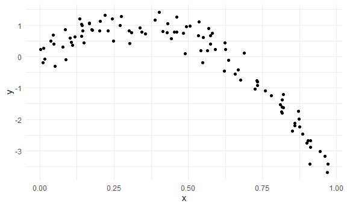
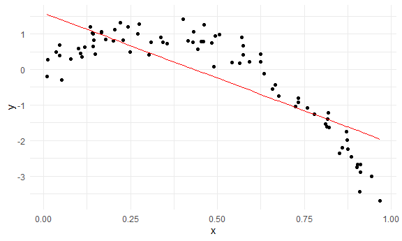
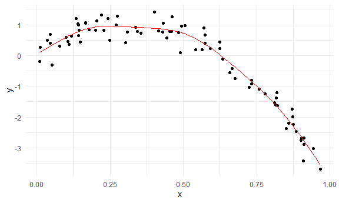
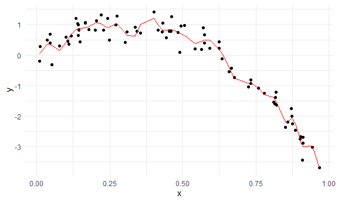
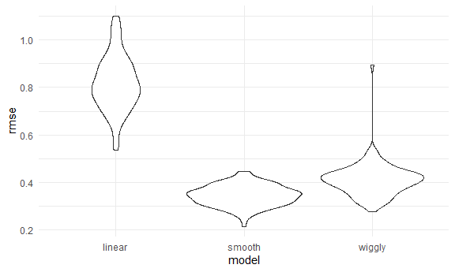
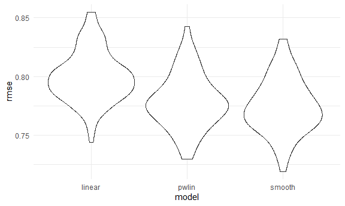

Cross Validation
================

``` r
library(tidyverse)
```

    ## -- Attaching packages ------------------------------------------------------------------------------------------------------------------- tidyverse 1.3.0 --

    ## v ggplot2 3.3.2     v purrr   0.3.4
    ## v tibble  3.0.3     v dplyr   1.0.2
    ## v tidyr   1.1.2     v stringr 1.4.0
    ## v readr   1.3.1     v forcats 0.5.0

    ## -- Conflicts ---------------------------------------------------------------------------------------------------------------------- tidyverse_conflicts() --
    ## x dplyr::filter() masks stats::filter()
    ## x dplyr::lag()    masks stats::lag()

``` r
library(modelr)
library(mgcv)
```

    ## Loading required package: nlme

    ## 
    ## Attaching package: 'nlme'

    ## The following object is masked from 'package:dplyr':
    ## 
    ##     collapse

    ## This is mgcv 1.8-33. For overview type 'help("mgcv-package")'.

``` r
knitr::opts_chunk$set(
  fig.width = 6,
  fig.asp = 0.6,
  out.width = "90%"
)

theme_set(theme_minimal() + theme(legend.position = "bottom"))

## all plots i make will have the viridis color palette
options(
  ggplot2.continuous.colour = "viridis",
  ggplot2.continuous.fill = "viridis"
)

scale_colour_discrete = scale_colour_viridis_d
scale_fill_discrete = scale_fill_viridis_d
```

## Simulate Data

``` r
nonlin_df = 
  tibble(
    id = 1:100,
    x = runif(100, 0, 1),
    y = 1 - 10 * (x - .3) ^ 2 + rnorm(100, 0, .3)
  )
```

Look at data… it is non linear

``` r
nonlin_df %>% 
  ggplot(aes(x = x, y = y)) + 
  geom_point()
```



## Cross validation – by hand

Get training and testing datasets

``` r
## sample 80 observations
train_df = sample_n(nonlin_df, size = 80)

## the remaining 20 goes into test dataset (observations in nonlin_df BUT not in training df)
test_df = anti_join(nonlin_df, train_df, by = "id")
```

## Build models using training dataset

``` r
linear_model = lm(y ~ x, data = train_df)
#smooth model
smooth_mod = gam(y ~ s(x), data = train_df)
#very wiggly model
wiggle_mod = gam(y ~s(x, k = 30), sp = 10e-6, data = train_df)
```

Can I see what I just did “add\_predictions” adds a column of fitted
values

``` r
## too linear
train_df %>% 
  add_predictions(linear_model) %>% 
  ggplot(aes(x = x, y = y)) +
  geom_point() +
  geom_line(aes(y = pred), color = "red")
```



``` r
## good (looks like it will do best at predictioj accuracy)
train_df %>% 
  add_predictions(smooth_mod) %>% 
  ggplot(aes(x = x, y = y)) +
  geom_point() +
  geom_line(aes(y = pred), color = "red")
```



``` r
## too wiggly
train_df %>% 
  add_predictions(wiggle_mod) %>% 
  ggplot(aes(x = x, y = y)) +
  geom_point() +
  geom_line(aes(y = pred), color = "red")
```



Add predictions for multiple models at the same time

``` r
train_df %>% 
  gather_predictions(linear_model, smooth_mod, wiggle_mod) %>% 
  ggplot(aes(x = x, y = y)) +
  geom_point() +
  geom_line(aes(y = pred), color = "red") +
  facet_grid(. ~model)
```


Look at prediction accuracy (calculate root mean squared error) (have to
look at test dataset)

``` r
## largest
rmse(linear_model, test_df)
```

    ## [1] 0.9764204

``` r
## smallest (best)
rmse(smooth_mod, test_df)
```

    ## [1] 0.3460459

``` r
## middle
rmse(wiggle_mod, test_df)
```

    ## [1] 0.4248057

## Cross validation using `modelr` package

This package automates the process of generating a testing and training
dataset 100 cross validation runs Drawing mulitple samples from a
dataset that already exists 100 different datasets that sample different
stuff from the existing dataset

``` r
cv_df = 
  crossv_mc(nonlin_df, 100)
```

What is going on here… We can covert any one of those samples into
dataframes

``` r
cv_df %>% pull(train) %>% .[[1]] %>% as_tibble()
```

    ## # A tibble: 79 x 3
    ##       id      x      y
    ##    <int>  <dbl>  <dbl>
    ##  1     1 0.575   0.661
    ##  2     2 0.178   0.841
    ##  3     3 0.872  -1.74 
    ##  4     4 0.0364  0.497
    ##  5     5 0.872  -1.99 
    ##  6     6 0.876  -2.25 
    ##  7     9 0.821  -1.62 
    ##  8    10 0.569   0.897
    ##  9    11 0.817  -1.39 
    ## 10    12 0.144   0.820
    ## # ... with 69 more rows

``` r
cv_df %>% pull(test) %>% .[[1]] %>% as_tibble()
```

    ## # A tibble: 21 x 3
    ##       id     x      y
    ##    <int> <dbl>  <dbl>
    ##  1     7 0.431  1.05 
    ##  2     8 0.415  0.809
    ##  3    17 0.270  0.994
    ##  4    23 0.689  0.108
    ##  5    32 0.135  1.20 
    ##  6    33 0.142  0.995
    ##  7    35 0.909 -3.43 
    ##  8    39 0.960 -3.17 
    ##  9    41 0.356  0.725
    ## 10    45 0.249  0.488
    ## # ... with 11 more rows

I want list columns of straight dataframes, not resamples

``` r
cv_df =
  cv_df %>% 
  mutate(
    train = map(train, as_tibble),
    test = map(test, as_tibble)
  )
```

Let’s try to fit models and get RMSEs for them

Fit linear models for every element in the training column (100
dataframes) Produces a list column with linear models map\_dbl gives it
as a number rather than a list

``` r
cv_df = 
  cv_df %>% 
  mutate(
    linear_mod  = map(.x = train, ~lm(y ~ x, data = .x)),
    smooth_mod = map(.x = train, ~gam(y ~s(x), data = .x)),
    wiggly_mod = map(.x = train, ~gam(y ~s(x, k = 30), sp = 10e-6, data = .x))
  ) %>% 
  mutate(
    rmse_linear = map2_dbl(.x = linear_mod, .y = test, ~rmse(model = .x, data = .y)),
    rmse_smooth = map2_dbl(.x = smooth_mod, .y = test, ~rmse(model = .x, data = .y)),
    rmse_wiggly = map2_dbl(.x = wiggly_mod, .y = test, ~rmse(model = .x, data = .y))
  )
```

How do we know which model is the best?

Plotted the distribution over 100 different training sets for 3
different models

``` r
cv_df %>% 
  select(starts_with("rmse")) %>% 
  pivot_longer(
    everything(),
    names_to = "model",
    values_to = "rmse",
    names_prefix = "rmse_"
  ) %>% 
  ggplot(aes(x = model, y = rmse)) +
  geom_violin()
```



Commute averages of rmse

``` r
cv_df %>% 
  select(starts_with("rmse")) %>% 
  pivot_longer(
    everything(),
    names_to = "model",
    values_to = "rmse",
    names_prefix = "rmse_"
  ) %>% 
  group_by(model) %>% 
  summarize(avg_rmse = mean(rmse))
```

    ## `summarise()` ungrouping output (override with `.groups` argument)

    ## # A tibble: 3 x 2
    ##   model  avg_rmse
    ##   <chr>     <dbl>
    ## 1 linear    0.846
    ## 2 smooth    0.301
    ## 3 wiggly    0.380

## Try eith a real dataset

Mutate function is for the change point model

``` r
child_growth = read_csv("./data/nepalese_children.csv") %>% 
  mutate(
    weight_cp = (weight > 7) * (weight - 7)
  )
```

    ## Parsed with column specification:
    ## cols(
    ##   age = col_double(),
    ##   sex = col_double(),
    ##   weight = col_double(),
    ##   height = col_double(),
    ##   armc = col_double()
    ## )

Weight versus arm circumference

``` r
child_growth %>% 
  ggplot(aes(x = weight, y = armc)) +
  geom_point(alpha = 0.3)
```


Fit the models

``` r
linear_mod = lm(armc ~ weight, data = child_growth)
pwlin_mod = lm(armc ~ weight + weight_cp, data = child_growth)
smooth_mod = gam(armc ~ s(weight), data = child_growth)
```

Gather predicted values from each model and make a plot

``` r
child_growth %>% 
  gather_predictions(linear_mod, pwlin_mod, smooth_mod) %>% 
  ggplot(aes(x = weight, y = armc)) +
  geom_point(alpha = 0.3) +
  geom_line(aes(y = pred), color = "red") +
  facet_grid(. ~ model)
```


Try to understand model fit using CV

``` r
cv_df = 
  crossv_mc(child_growth, 100) %>% 
  mutate(
    train = map(train, as_tibble),
    test = map(test, as_tibble)
  )
```

See if I can fit the models to the splits

``` r
cv_df = 
  cv_df %>% 
  mutate(
    linear_mod  = map(.x = train, ~lm(armc ~ weight, data = .x)),
    pwlin_mod = map(.x = train, ~lm(armc ~ weight + weight_cp, data = .x)),
    smooth_mod = map(.x = train, ~gam(armc ~s(weight), data = .x))
  ) %>% 
  mutate(
    rmse_linear = map2_dbl(.x = linear_mod, .y = test, ~rmse(model = .x, data = .y)),
    rmse_pwlin = map2_dbl(.x = pwlin_mod, .y = test, ~rmse(model = .x, data = .y)),
    rmse_smooth = map2_dbl(.x = smooth_mod, .y = test, ~rmse(model = .x, data = .y))
  )
```

Violin plot of RMSE These distributions are a lot closer than in the
simulated data

``` r
cv_df %>% 
  select(starts_with("rmse")) %>% 
  pivot_longer(
    everything(),
    names_to = "model",
    values_to = "rmse",
    names_prefix = "rmse_"
  ) %>% 
  ggplot(aes(x = model, y = rmse)) +
  geom_violin()
```


Jeff would pick piece wise linear model… because there is a clear
improvement between linear and pwlin (and not so much between pwlin and
the smooth model). The interpretations are a little more straight
forward than in a smooth model

Commute averages

``` r
cv_df %>% 
  select(starts_with("rmse")) %>% 
  pivot_longer(
    everything(),
    names_to = "model",
    values_to = "rmse",
    names_prefix = "rmse_"
  ) %>% 
  group_by(model) %>% 
  summarize(avg_rmse = mean(rmse))
```

    ## `summarise()` ungrouping output (override with `.groups` argument)

    ## # A tibble: 3 x 2
    ##   model  avg_rmse
    ##   <chr>     <dbl>
    ## 1 linear    0.800
    ## 2 pwlin     0.779
    ## 3 smooth    0.775
