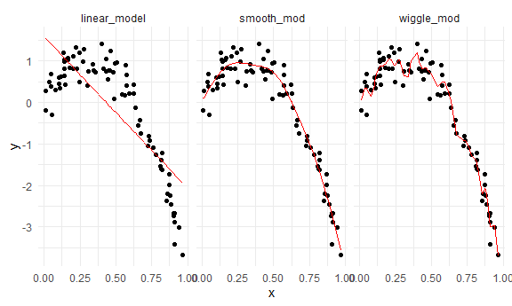
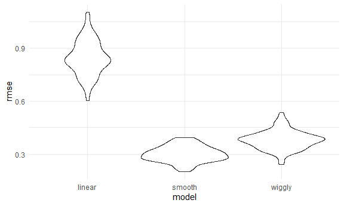

Cross Validation
================

``` r
library(tidyverse)
```

    ## -- Attaching packages ------------------------------------------------------------------------------------------------------------------ tidyverse 1.3.0 --

    ## v ggplot2 3.3.2     v purrr   0.3.4
    ## v tibble  3.0.3     v dplyr   1.0.2
    ## v tidyr   1.1.2     v stringr 1.4.0
    ## v readr   1.3.1     v forcats 0.5.0

    ## -- Conflicts --------------------------------------------------------------------------------------------------------------------- tidyverse_conflicts() --
    ## x dplyr::filter() masks stats::filter()
    ## x dplyr::lag()    masks stats::lag()

``` r
library(modelr)
library(mgcv)
```

    ## Loading required package: nlme

    ## 
    ## Attaching package: 'nlme'

    ## The following object is masked from 'package:dplyr':
    ## 
    ##     collapse

    ## This is mgcv 1.8-33. For overview type 'help("mgcv-package")'.

``` r
knitr::opts_chunk$set(
  fig.width = 6,
  fig.asp = 0.6,
  out.width = "90%"
)

theme_set(theme_minimal() + theme(legend.position = "bottom"))

## all plots i make will have the viridis color palette
options(
  ggplot2.continuous.colour = "viridis",
  ggplot2.continuous.fill = "viridis"
)

scale_colour_discrete = scale_colour_viridis_d
scale_fill_discrete = scale_fill_viridis_d
```

## Simulate Data

``` r
nonlin_df = 
  tibble(
    id = 1:100,
    x = runif(100, 0, 1),
    y = 1 - 10 * (x - .3) ^ 2 + rnorm(100, 0, .3)
  )
```

Look at data… it is non linear

``` r
nonlin_df %>% 
  ggplot(aes(x = x, y = y)) + 
  geom_point()
```


## Cross validation – by hand

Get training and testing datasets

``` r
## sample 80 observations
train_df = sample_n(nonlin_df, size = 80)

## the remaining 20 goes into test dataset (observations in nonlin_df BUT not in training df)
test_df = anti_join(nonlin_df, train_df, by = "id")
```

## Build models using training dataset

``` r
linear_model = lm(y ~ x, data = train_df)
#smooth model
smooth_mod = gam(y ~ s(x), data = train_df)
#very wiggly model
wiggle_mod = gam(y ~s(x, k = 30), sp = 10e-6, data = train_df)
```

Can I see what I just did “add\_predictions” adds a column of fitted
values

``` r
## too linear
train_df %>% 
  add_predictions(linear_model) %>% 
  ggplot(aes(x = x, y = y)) +
  geom_point() +
  geom_line(aes(y = pred), color = "red")
```


``` r
## good (looks like it will do best at predictioj accuracy)
train_df %>% 
  add_predictions(smooth_mod) %>% 
  ggplot(aes(x = x, y = y)) +
  geom_point() +
  geom_line(aes(y = pred), color = "red")
```


``` r
## too wiggly
train_df %>% 
  add_predictions(wiggle_mod) %>% 
  ggplot(aes(x = x, y = y)) +
  geom_point() +
  geom_line(aes(y = pred), color = "red")
```


Add predictions for multiple models at the same time

``` r
train_df %>% 
  gather_predictions(linear_model, smooth_mod, wiggle_mod) %>% 
  ggplot(aes(x = x, y = y)) +
  geom_point() +
  geom_line(aes(y = pred), color = "red") +
  facet_grid(. ~model)
```



Look at prediction accuracy (calculate root mean squared error) (have to
look at test dataset)

``` r
## largest
rmse(linear_model, test_df)
```

    ## [1] 0.9146237

``` r
## smallest (best)
rmse(smooth_mod, test_df)
```

    ## [1] 0.3497416

``` r
## middle
rmse(wiggle_mod, test_df)
```

    ## [1] 0.4403312

## Cross validation using `modelr` package

This package automates the process of generating a testing and training
dataset 100 cross validation runs Drawing mulitple samples from a
dataset that already exists 100 different datasets that sample different
stuff from the existing dataset

``` r
cv_df = 
  crossv_mc(nonlin_df, 100)
```

What is going on here… We can covert any one of those samples into
dataframes

``` r
cv_df %>% pull(train) %>% .[[1]] %>% as_tibble()
```

    ## # A tibble: 79 x 3
    ##       id       x      y
    ##    <int>   <dbl>  <dbl>
    ##  1     1 0.306    0.834
    ##  2     2 0.00137 -0.298
    ##  3     3 0.817   -1.15 
    ##  4     5 0.344    0.160
    ##  5     6 0.230    0.722
    ##  6     7 0.812   -1.38 
    ##  7     8 0.854   -2.01 
    ##  8     9 0.00226  0.170
    ##  9    10 0.573    0.425
    ## 10    11 0.420    0.345
    ## # ... with 69 more rows

``` r
cv_df %>% pull(test) %>% .[[1]] %>% as_tibble()
```

    ## # A tibble: 21 x 3
    ##       id        x       y
    ##    <int>    <dbl>   <dbl>
    ##  1     4 0.571     0.252 
    ##  2    14 0.664    -0.0614
    ##  3    16 0.542     0.427 
    ##  4    20 0.948    -3.70  
    ##  5    22 0.770    -1.45  
    ##  6    23 0.215     1.29  
    ##  7    34 0.638     0.599 
    ##  8    35 0.000219 -0.446 
    ##  9    42 0.183     1.54  
    ## 10    44 0.274     0.561 
    ## # ... with 11 more rows

I want list columns of straight dataframes, not resamples

``` r
cv_df =
  cv_df %>% 
  mutate(
    train = map(train, as_tibble),
    test = map(test, as_tibble)
  )
```

Let’s try to fit models and get RMSEs for them

Fit linear models for every element in the training column (100
dataframes) Produces a list column with linear models map\_dbl gives it
as a number rather than a list

``` r
cv_df = 
  cv_df %>% 
  mutate(
    linear_mod  = map(.x = train, ~lm(y ~ x, data = .x)),
    smooth_mod = map(.x = train, ~gam(y ~s(x), data = .x)),
    wiggly_mod = map(.x = train, ~gam(y ~s(x, k = 30), sp = 10e-6, data = .x))
  ) %>% 
  mutate(
    rmse_linear = map2_dbl(.x = linear_mod, .y = test, ~rmse(model = .x, data = .y)),
    rmse_smooth = map2_dbl(.x = smooth_mod, .y = test, ~rmse(model = .x, data = .y)),
    rmse_wiggly = map2_dbl(.x = wiggly_mod, .y = test, ~rmse(model = .x, data = .y))
  )
```

How do we know which model is the best?

Plotted the distribution over 100 different training sets for 3
different models

``` r
cv_df %>% 
  select(starts_with("rmse")) %>% 
  pivot_longer(
    everything(),
    names_to = "model",
    values_to = "rmse",
    names_prefix = "rmse_"
  ) %>% 
  ggplot(aes(x = model, y = rmse)) +
  geom_violin()
```



Commute averages of rmse

``` r
cv_df %>% 
  select(starts_with("rmse")) %>% 
  pivot_longer(
    everything(),
    names_to = "model",
    values_to = "rmse",
    names_prefix = "rmse_"
  ) %>% 
  group_by(model) %>% 
  summarize(avg_rmse = mean(rmse))
```

    ## `summarise()` ungrouping output (override with `.groups` argument)

    ## # A tibble: 3 x 2
    ##   model  avg_rmse
    ##   <chr>     <dbl>
    ## 1 linear    0.817
    ## 2 smooth    0.345
    ## 3 wiggly    0.411
